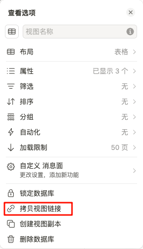
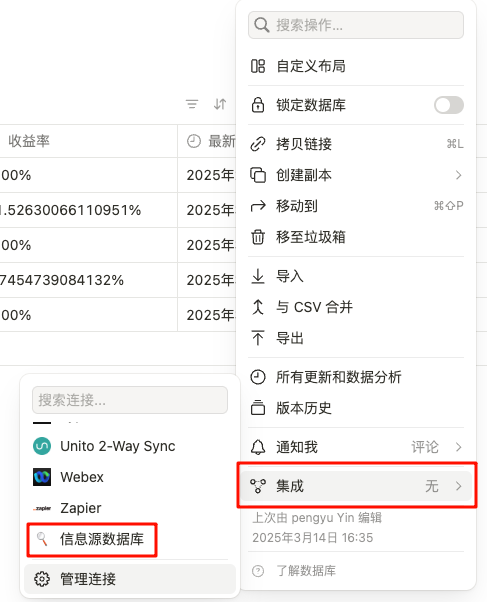

# OctopusScraper
OctopusScraper 是一款多功能信息抓取工具，旨在通过高效的算法分析和处理各种媒体数据。它隶属于 [Podcast 矩阵生成项目](https://www.notion.so/1a2fee3943728058be3be79b782e1cf4?pvs=4)，但具备广泛的应用潜力，可以作为中间件为其他项目提供数据抓取和分析能力。OctopusScraper 灵活高效，能够为后续项目提供强大的支持，助力快速实现数据整合与分析，为各类项目赋能。

## Installation
```bash
poetry install
```
Note: 更多的安装信息可以使用 `-vvv` 来 debug。

## Usage
```bash
poetry run octopus_go
```

## Dev Dependencies
1. Pre-commit Installation
    ```bash
    brew install pre-commit
    ```
2. Mannually Check
    ```bash
    pre-commit run --all-files
    ```

## Notion API
1.	获取Notion的API密钥
* 需要在Notion的[开发者页面](https://www.notion.so/profile/integrations)创建一个集成，并获取API密钥

  
2.   获取数据库ID

在数据库下拉菜单中，选择**拷贝视图链接**



以如下链接为例：

https://www.notion.so/1a7fee39437281feace5c0ad44df8fb6?v=1a7fee39437281c4a958000c6e469dbd&pvs=4

链接中```1a7fee39437281feace5c0ad44df8fb6```便是notion数据库 ID。

3. 授予集成数据库权限

   为了集成能够读写数据库，还需要在数据库中授予第一步创建的集成权限。授权之后即可使用notion-client库与Notion API交互。

   

   
