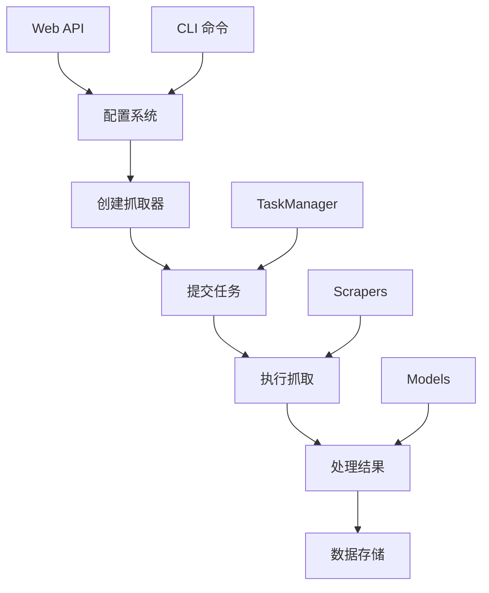

# OctopusScraper 文档
> Caution 无人工校验，后期需要人工做校验

欢迎使用 OctopusScraper 文档。本文档采用分层组织结构，分为**接口文档**和**模型文档**两大类别，帮助您快速了解和使用 OctopusScraper。

> 📢 **架构更新**: OctopusScraper 已完成重大架构重构，TaskManager 现已成为统一的任务执行引擎，提供完整的任务调度、监控和管理功能。

## 文档结构

```
docs/
├── interface/               # 接口文档 - 外部交互接口
│   ├── web_service/        # Web 服务接口 (REST API)
│   └── cli/               # 命令行接口 (CLI)
└── models/                # 模型文档 - 内部代码结构
    ├── config/            # 配置管理模型
    ├── task_manager/      # 任务管理模型 (统一执行引擎)
    ├── scrapers/          # 抓取器模型
    ├── storages/          # 存储器模型
    ├── processors/        # 内容处理器模型
    └── service/           # 服务数据模型
```

## 📢 快速开始

- **[主要 README](../README.md)** - 完整的安装和使用指南
- **[配置示例](../config.example.yml)** - 推荐的配置文件模板
- **[架构概览](#架构概览)** - 了解 OctopusScraper 的整体架构

## 接口文档 (Interface)

### Web 服务接口

Web 服务接口提供 HTTP API 用于远程管理和操作 OctopusScraper：

- **[管理接口文档](./interface/web_service/admin-interface.md)** - 完整的 Web 管理 API 参考
- **[管理接口测试](./interface/web_service/admin-interface-testing.md)** - Web API 的测试方法和用例

**主要功能：**

- 🔧 配置管理 API (15+ 端点)
- 📊 任务管理和监控 API  
- 🕷️ 抓取器控制 API
- 📅 定时调度管理 API
- 📈 系统状态和统计 API
- 🔒 安全认证和权限控制

**适用场景：**

- Web 界面集成
- 第三方系统集成
- 远程管理和监控
- RESTful API 开发

### 命令行接口

命令行接口提供简洁高效的本地管理工具：

- **[CLI 接口文档](./interface/cli/cli-interface.md)** - 完整的命令行工具参考

**可用命令：**

- `octopus_go` - 一次性抓取任务执行
- `octopus_service` - Web 服务启动和管理

**主要特性：**

- 📁 配置文件支持 (YAML)
- ⚡ 快速抓取和上传
- � 与任务管理器无缝集成
- 📊 实时状态显示
- 🎯 灵活的参数配置

**适用场景：**

- 开发和测试环境
- 自动化脚本集成
- 定时任务执行
- 本地调试和开发

## 模型文档 (Models)

### 配置管理模型

动态配置系统负责管理所有抓取器、任务、系统设置：

- **[ConfigManager 模型](./models/config/config-manager.md)** - 配置管理器的核心功能和数据结构
- **[ConfigManager 测试](./models/config/config-manager-testing.md)** - 配置系统的测试策略和用例

**核心组件：**

- `ConfigManager` - 统一配置管理、热重载、验证
- `ScraperConfig` - 抓取器配置数据结构  
- `ServiceConfig` - 服务配置和环境变量支持
- `NotionDatabaseConfig` - Notion 集成配置
- 动态配置监控和更新系统

**主要功能：**

- 🔄 热重载和实时配置更新
- ✅ 配置验证和错误检查
- 📊 版本控制和变更跟踪
- 🔗 Notion 数据库集成
- 🌐 环境变量支持

### 任务管理模型

TaskManager 现已成为 OctopusScraper 的统一任务执行引擎，负责所有后台操作的异步执行、调度和监控：

- **[TaskManager 模型](./models/task_manager/task-manager.md)** - 统一任务管理器和调度系统
- **[TaskManager 测试](./models/task_manager/task-manager-testing.md)** - 任务系统的全面测试覆盖

**核心组件：**

- `TaskManager` - 统一任务队列、执行引擎、监控系统（默认启用）
- `TaskScheduler` - 定时任务和 Cron 表达式调度
- `ScraperTask` - 抓取任务模型和生命周期管理
- `TaskBatch` - 批量任务处理和协调
- `TaskResult` - 任务结果、统计信息和性能指标

**主要功能：**

- 🎛️ 优先级队列和并发控制
- 📅 Cron 表达式定时调度
- 🔄 智能重试和错误恢复
- 📊 实时监控和统计分析
- 🏗️ 任务生命周期钩子

### 抓取器模型

网页内容抓取器系统提供多种数据源支持：

- **[Scrapers 模型](./models/scrapers/scrapers.md)** - 抓取器架构和实现细节
- **[Scrapers 测试](./models/scrapers/scrapers-testing.md)** - 抓取器测试和验证

**核心组件：**

- `Scraper` - 统一抓取器接口和基类
- `BaseScraperConfig` - 抓取器配置管理
- `Content` - 内容数据模型和处理
- Fetcher 支持 (RSSHub、Direct RSS)
- 内容去重和存储集成

**主要功能：**

- 🌐 多种数据源支持 (RSS、Web API)
- 🔧 可配置的 fetcher 和 processor
- 📝 内容预处理和标准化
- 🔄 存储集成和去重机制
- ⚡ 高性能批量处理

### 存储器模型  

数据存储和持久化系统：

- **[Storages 模型](./models/storages/storages.md)** - 存储器架构和 Notion 集成
- **[Storages 测试](./models/storages/storages-testing.md)** - 存储系统测试和验证

**核心组件：**

- `BaseStorage` - 存储器接口和抽象基类
- `NotionStorage` - Notion API 集成实现
- 内容去重和冲突检测机制
- 批量上传和错误处理

**主要功能：**

- 📚 Notion 数据库无缝集成
- 🔍 智能内容去重检测
- 📦 批量操作和性能优化
- 🛡️ 错误处理和重试机制
- 🔗 多存储后端支持架构

### 处理器模型

内容处理和增强系统：

- **[Processors 模型](./models/processors/processors.md)** - 内容处理器架构和实现
- **[Processors 测试](./models/processors/processors-testing.md)** - 处理器测试和验证

**核心组件：**

- `HTMLContentProcessor` - HTML 内容解析和清理
- `LLMProcessor` - AI 大语言模型内容增强
- 可插拔的处理器架构

**主要功能：**

- 🧹 HTML 内容清理和格式化
- 🤖 AI 内容摘要和标签生成
- 🔧 可配置的处理管道
- 📝 内容标准化和规范化

### 服务模型

Web 服务的数据传输对象和响应格式：

- **[Service Models](./models/service/service-models.md)** - Web API 数据结构和响应格式
- **[Service Models 测试](./models/service/service-models-testing.md)** - 服务模型测试和验证

**核心组件：**

- `TriggerScraperResponse` - 抓取触发响应
- `TriggerUploadResponse` - 上传触发响应
- `TaskModel` - 任务状态和结果模型
- `ScheduleModel` - 调度任务配置模型
- `AdminResponse` - 管理接口响应
- `ErrorResponse` - 标准错误响应格式
- `SystemInfo` - 系统信息和健康状态

**主要功能：**

- 🔄 统一的 API 响应格式
- 📊 详细的任务状态跟踪
- 🕐 调度任务状态管理
- ❌ 标准化错误处理
- 📈 系统健康监控

## 架构概览

OctopusScraper 采用模块化架构，各组件职责分离、高度可配置：

```
┌─────────────────────────────────────────────────────────────┐
│                        用户接口                             │
├─────────────────────┬───────────────────────────────────────┤
│      CLI 接口       │           Web 服务接口                │
│   (octopus_go)      │        (octopus_service)              │
└─────────────────────┴───────────────────────────────────────┘
                              │
┌─────────────────────────────────────────────────────────────┐
│                     核心服务层                              │
├─────────────────────────────────────────────────────────────┤
│                  Octopus (核心调度器)                       │
└─────────────────────────────────────────────────────────────┘
                              │
┌─────────────────────────────────────────────────────────────┐
│                    任务管理层                               │
├───────────────────────┬─────────────────────────────────────┤
│     TaskManager       │         TaskScheduler               │
│   (统一任务执行)      │       (定时调度管理)                │
└───────────────────────┴─────────────────────────────────────┘
                              │
┌─────────────────────────────────────────────────────────────┐
│                    业务逻辑层                               │
├─────────────┬─────────────────┬─────────────────┬───────────┤
│  Scrapers   │   Processors    │   Storages      │  Config   │
│  (内容抓取) │   (内容处理)    │   (数据存储)    │ (配置管理)│
└─────────────┴─────────────────┴─────────────────┴───────────┘
                              │
┌─────────────────────────────────────────────────────────────┐
│                    外部服务层                               │
├─────────────────────┬───────────────────────────────────────┤
│     数据源接口      │            存储服务接口               │
│   (RSSHub, RSS)     │           (Notion API)               │
└─────────────────────┴───────────────────────────────────────┘
```

### 关键设计原则

- **统一任务管理**: 所有操作都通过 TaskManager 执行
- **可插拔架构**: Fetchers、Processors、Storages 都支持扩展
- **配置驱动**: 通过配置文件或 Notion 数据库动态配置
- **异步优先**: 基于 asyncio 的高性能异步处理
- **监控友好**: 内置完整的监控和日志系统

## 快速开始

### 1. 选择您的使用方式

**Web API 开发者**：
→ 开始阅读 [管理接口文档](./interface/web_service/admin-interface.md)

**命令行用户**：
→ 开始阅读 [CLI 接口文档](./interface/cli/cli-interface.md)

**系统开发者**：
→ 开始阅读 [ConfigManager 模型](./models/config/config-manager.md)

### 2. 基本操作流程



### 3. 配置示例

```yaml
# config.yml - 基本配置示例（使用任务管理系统格式）
scrapers_config_with_fetch_params:
  # VS Code 博客抓取
  - scraper_config:
      fetcher_name: "direct_rss"
      fetcher_config:
        rss_url: "https://code.visualstudio.com/feed.xml"
      content_processor_configs: {}
    fetch_params:
      limit: 20

  # 少数派文章抓取
  - scraper_config:
      fetcher_name: "rsshub"
      fetcher_config:
        hub_root: "https://rsshub.app"
        route: "/sspai/matrix"
      content_processor_configs: {}
    fetch_params:
      limit: 30

# 任务管理器配置
task_manager:
  max_concurrent_tasks: 3
  max_queue_size: 100

# 服务器配置
server:
  host: "127.0.0.1"
  port: 8000
```

## 开发和测试

### 运行测试

```bash
# 运行所有测试
poetry run pytest

# 运行特定组件测试
poetry run pytest tests/octopus_scraper/config/ -v
poetry run pytest tests/octopus_scraper/task_manager/ -v
poetry run pytest tests/octopus_scraper/scrapers/ -v

# 运行集成测试
poetry run pytest tests/octopus_scraper/octopus_service_test.py -v
```

### 测试覆盖率

```bash
# 生成覆盖率报告
poetry run pytest --cov=src/octopus_scraper --cov-report=html

# 查看覆盖率报告
open htmlcov/index.html
```

## 架构概览

### 系统架构

```
┌─────────────────┐    ┌─────────────────┐
│   Web API       │    │   CLI Interface │
│   (Sanic)       │    │   (Click)       │
└─────────┬───────┘    └─────────┬───────┘
          │                      │
          └──────────┬───────────┘
                     │
┌────────────────────▼────────────────────┐
│            OctopusService               │
│         (Main Service Layer)            │
└─────┬─────────┬─────────┬─────────┬─────┘
      │         │         │         │
┌─────▼─────┐ ┌─▼──────┐ ┌─▼──────┐ ┌─▼──────┐
│ Config    │ │ Task   │ │Scrapers│ │ Models │
│ Manager   │ │Manager │ │        │ │        │
└───────────┘ └────────┘ └────────┘ └────────┘
```

### 数据流

```
External Sources → Scrapers → TaskManager → Models → Storage
      ↑              ↓           ↓          ↓        ↓
   [RSS/API]     [Processing]  [Queue]   [Validation] [DB/File]
                     ↓           ↓          ↓
                 Web API ←── Service ←── Results
                     ↓
                 Frontend
```

## 贡献指南

### 文档贡献

1. **接口文档**：添加新的 API 端点或 CLI 命令时，请更新相应的接口文档
2. **模型文档**：修改数据结构时，请同步更新模型文档
3. **测试文档**：添加新测试时，请在测试文档中描述测试策略

### 文档规范

- 使用 Markdown 格式
- 包含代码示例和用法
- 提供完整的参数说明
- 添加相关文档的交叉引用

## 支持和反馈

如果您在使用文档时遇到问题：

1. 查看相关的测试文档了解具体用法
2. 检查代码示例和配置示例
3. 参考交叉引用的相关文档
4. 提交 Issue 或 Pull Request

---

**导航提示：**

- 📖 **新用户**：推荐从 [CLI 接口文档](./interface/cli/cli-interface.md) 开始
- 🔧 **开发者**：推荐从 [管理接口文档](./interface/web_service/admin-interface.md) 开始
- 🏗️ **贡献者**：推荐从 [ConfigManager 模型](./models/config/config-manager.md) 开始
