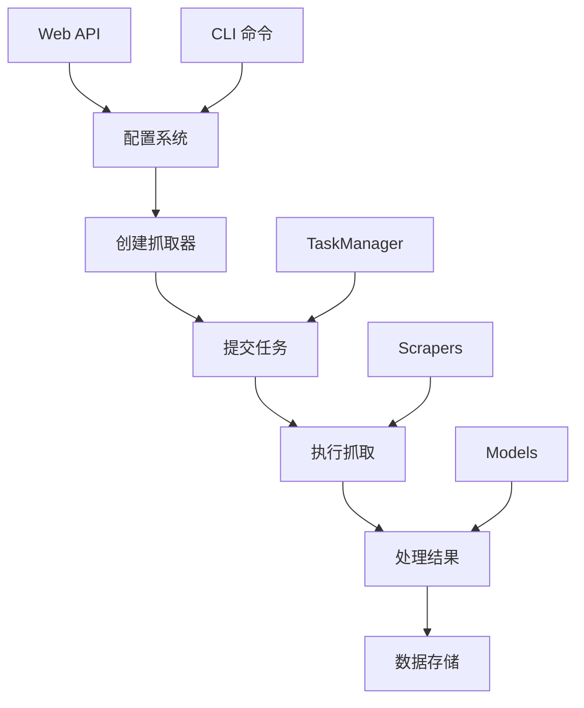

# OctopusScraper 文档

欢迎使用 OctopusScraper 文档。本文档采用分层组织结构，分为**接口文档**和**模型文档**两大类别，帮助您快速了解和使用 OctopusScraper。

> 📢 **重要更新**: TaskManager 现已成为统一的任务执行引擎，详见 [TaskManager 架构更新指南](./TASK_MANAGER_UPDATES.md)

## 文档结构

```
docs/
├── TASK_MANAGER_UPDATES.md  # 📢 TaskManager 架构更新指南
├── interface/               # 接口文档 - 外部交互接口
│   ├── web_service/        # Web 服务接口
│   └── cli/               # 命令行接口
└── models/                # 模型文档 - 内部代码结构
    ├── config/            # 配置管理模型
    ├── task_manager/      # 任务管理模型 (统一执行引擎)
    ├── scrapers/          # 抓取器模型
    └── service/           # 服务数据模型
```

## 📢 快速开始

- **[主要 README](../README.md)** - 完整的安装和使用指南
- **[配置示例](../config.example.yml)** - 推荐的配置文件模板

## 接口文档 (Interface)

### Web 服务接口

Web 服务接口提供 HTTP API 用于远程管理和操作 OctopusScraper：

- **[管理接口文档](./interface/web_service/admin-interface.md)** - 完整的 Web 管理 API 参考
- **[管理接口测试](./interface/web_service/admin-interface-testing.md)** - Web API 的测试方法和用例

**主要功能：**

- 🔧 配置管理 API (15+ 端点)
- 📊 任务管理和监控 API
- 🕷️ 抓取器控制 API
- 📈 系统状态和统计 API
- 🔒 安全认证和权限控制

**适用场景：**

- Web 界面集成
- 第三方系统集成
- 远程管理和监控
- RESTful API 开发

### 命令行接口

命令行接口提供本地命令行工具用于直接操作：

- **[CLI 接口文档](./interface/cli/cli-interface.md)** - 完整的命令行工具参考

**主要功能：**

- ⚙️ 配置管理命令 (`config`)
- 🕷️ 抓取器管理命令 (`scraper`)
- 📋 任务管理命令 (`task`)
- 🖥️ 服务器管理命令 (`server`)
- 📊 状态查看命令 (`status`)

**适用场景：**

- 本地开发和调试
- 自动化脚本集成
- 系统运维操作
- 快速配置和测试

## 模型文档 (Models)

### 配置管理模型

配置系统负责管理所有抓取器、任务、系统设置：

- **[ConfigManager 模型](./models/config/config-manager.md)** - 配置管理器的核心功能和数据结构
- **[ConfigManager 测试](./models/config/config-manager-testing.md)** - 配置系统的测试策略和用例

**核心组件：**

- `ConfigManager` - 配置加载、验证、更新
- `ConfigModel` - 配置数据结构定义
- `NotionConfig` - Notion 集成配置
- 配置验证和类型检查系统

### 任务管理模型

TaskManager 现已成为 OctopusScraper 的统一任务执行引擎，负责所有后台操作的异步执行、调度和监控：

- **[TaskManager 模型](./models/task_manager/task-manager.md)** - 统一任务管理器和调度系统
- **[TaskManager 测试](./models/task_manager/task-manager-testing.md)** - 任务系统的全面测试覆盖

**核心组件：**

- `TaskManager` - 统一任务队列、执行引擎、监控系统（默认启用）
- `TaskScheduler` - 定时任务和 Cron 表达式调度
- `Task` - 任务基类和完整生命周期管理
- `TaskResult` - 任务结果、统计信息和性能指标

### 抓取器模型

抓取器系统负责从各种数据源获取内容：

- **[Scrapers 模型](./models/scrapers/scrapers.md)** - 抓取器架构和实现
- **[Scrapers 测试](./models/scrapers/scrapers-testing.md)** - 抓取器的测试方法

**核心组件：**

- `BaseScraper` - 抓取器基类和接口
- `DirectRssScraper` - RSS 直接抓取器
- `RsshubScraper` - RSSHub 集成抓取器
- `NotionApiScraper` - Notion API 抓取器
- `ContentDeduplicator` - 内容去重处理器

### 服务数据模型

服务模型定义了系统中所有数据结构和 API 响应格式：

- **[Service Models](./models/service/service-models.md)** - 完整的数据模型参考
- **[Service Models 测试](./models/service/service-models-testing.md)** - 数据模型的测试覆盖

**核心组件：**

- `ScrapingItem` - 抓取项目数据模型
- `ScrapingResult` - 抓取结果数据模型
- `TaskModel` - 任务数据模型
- `AdminResponse` - API 响应模型
- 统计和聚合数据模型

## 快速开始

### 1. 选择您的使用方式

**Web API 开发者**：
→ 开始阅读 [管理接口文档](./interface/web_service/admin-interface.md)

**命令行用户**：
→ 开始阅读 [CLI 接口文档](./interface/cli/cli-interface.md)

**系统开发者**：
→ 开始阅读 [ConfigManager 模型](./models/config/config-manager.md)

### 2. 基本操作流程



### 3. 配置示例

```yaml
# config.yml - 基本配置示例（使用任务管理系统格式）
scrapers_config_with_fetch_params:
  # VS Code 博客抓取
  - scraper_config:
      fetcher_name: "direct_rss"
      fetcher_config:
        rss_url: "https://code.visualstudio.com/feed.xml"
      content_processor_configs: {}
    fetch_params:
      limit: 20

  # 少数派文章抓取
  - scraper_config:
      fetcher_name: "rsshub"
      fetcher_config:
        hub_root: "https://rsshub.app"
        route: "/sspai/matrix"
      content_processor_configs: {}
    fetch_params:
      limit: 30

# 任务管理器配置
task_manager:
  max_concurrent_tasks: 3
  max_queue_size: 100

# 服务器配置
server:
  host: "127.0.0.1"
  port: 8000
```

## 开发和测试

### 运行测试

```bash
# 运行所有测试
poetry run pytest

# 运行特定组件测试
poetry run pytest tests/octopus_scraper/config/ -v
poetry run pytest tests/octopus_scraper/task_manager/ -v
poetry run pytest tests/octopus_scraper/scrapers/ -v

# 运行集成测试
poetry run pytest tests/octopus_scraper/octopus_service_test.py -v
```

### 测试覆盖率

```bash
# 生成覆盖率报告
poetry run pytest --cov=src/octopus_scraper --cov-report=html

# 查看覆盖率报告
open htmlcov/index.html
```

## 架构概览

### 系统架构

```
┌─────────────────┐    ┌─────────────────┐
│   Web API       │    │   CLI Interface │
│   (Sanic)       │    │   (Click)       │
└─────────┬───────┘    └─────────┬───────┘
          │                      │
          └──────────┬───────────┘
                     │
┌────────────────────▼────────────────────┐
│            OctopusService               │
│         (Main Service Layer)            │
└─────┬─────────┬─────────┬─────────┬─────┘
      │         │         │         │
┌─────▼─────┐ ┌─▼──────┐ ┌─▼──────┐ ┌─▼──────┐
│ Config    │ │ Task   │ │Scrapers│ │ Models │
│ Manager   │ │Manager │ │        │ │        │
└───────────┘ └────────┘ └────────┘ └────────┘
```

### 数据流

```
External Sources → Scrapers → TaskManager → Models → Storage
      ↑              ↓           ↓          ↓        ↓
   [RSS/API]     [Processing]  [Queue]   [Validation] [DB/File]
                     ↓           ↓          ↓
                 Web API ←── Service ←── Results
                     ↓
                 Frontend
```

## 贡献指南

### 文档贡献

1. **接口文档**：添加新的 API 端点或 CLI 命令时，请更新相应的接口文档
2. **模型文档**：修改数据结构时，请同步更新模型文档
3. **测试文档**：添加新测试时，请在测试文档中描述测试策略

### 文档规范

- 使用 Markdown 格式
- 包含代码示例和用法
- 提供完整的参数说明
- 添加相关文档的交叉引用

## 支持和反馈

如果您在使用文档时遇到问题：

1. 查看相关的测试文档了解具体用法
2. 检查代码示例和配置示例
3. 参考交叉引用的相关文档
4. 提交 Issue 或 Pull Request

---

**导航提示：**

- 📖 **新用户**：推荐从 [CLI 接口文档](./interface/cli/cli-interface.md) 开始
- 🔧 **开发者**：推荐从 [管理接口文档](./interface/web_service/admin-interface.md) 开始
- 🏗️ **贡献者**：推荐从 [ConfigManager 模型](./models/config/config-manager.md) 开始
