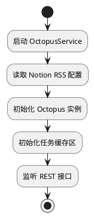
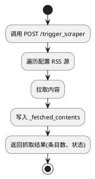
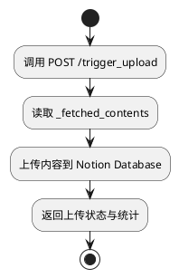
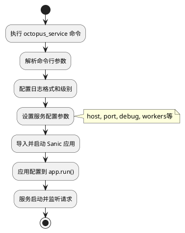
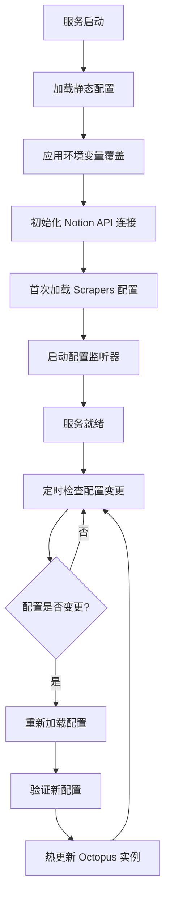
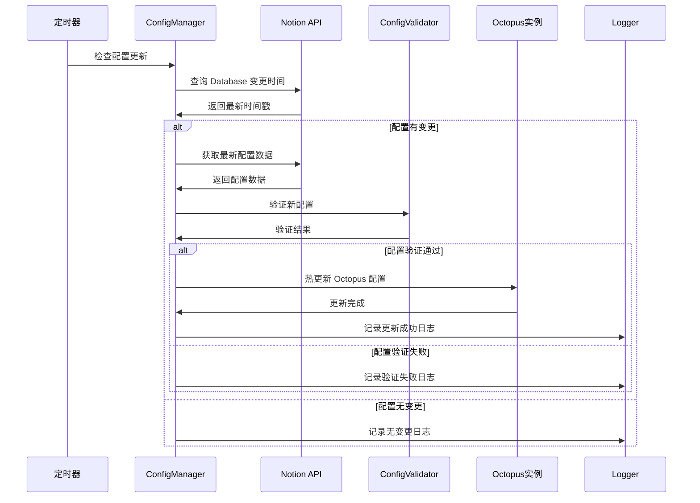

# OctopusService 技术设计文档 (TDD)

## 一、项目背景

Octopus 模块已具备读取 Notion 上配置信息，从多个 RSS 源抓取内容，并将抓取结果上传至 Notion Database 的核心业务逻辑。当前仅能通过本地脚本操作，缺乏服务化能力。为提升系统可集成性、可部署性，需封装为 REST 风格服务组件。

## 二、产品目标

构建 OctopusService 服务模块，基于已有 Octopus 功能对外暴露接口，支持远程触发抓取任务与上传任务，便于部署、调试和系统集成。

## 三、模块功能定义

### F1. 启动与初始化

- 加载 Notion 配置
- 初始化 Octopus 实例（可作为单例）

### F2. 接口触发抓取

- 提供 `/trigger_scraper` 接口
- 执行抓取逻辑，抓取内容写入 `_fetched_contents`

### F3. 接口触发上传

- 提供 `/trigger_upload` 接口
- 执行上传逻辑，读取 `_fetched_contents`，写入 Notion DB

### F4. 状态反馈

- 接口返回统一结构化响应
- 提供抓取条数、上传数等统计

### F5. 健康检查接口

- 提供 `/health` GET 接口，返回 JSON 状态，返回固定 JSON `{"status": "ok"}`，表示服务正常，设计轻量快速，不依赖外部系统

### F6. 日志记录与异常处理

- 使用 `structlog`
- 支持通过环境变量控制格式（plain / JSON）

### F7. 配置管理接口

- 提供 `/admin/config/status` 获取配置状态
- 提供 `/admin/config/refresh` 手动刷新配置
- 提供 `/admin/config/validate` 验证配置有效性

### F8. CLI 工具支持

- 提供 `octopus_service` 命令行工具
- 支持灵活的启动参数配置

## 四、模块结构设计

```
src/octopus_scraper/
├── cli/                     # CLI 工具模块
│   └── __init__.py         # 包含 run_octopus_service 函数
├── octopus_service.py      # Sanic 服务主入口
└── service_models.py       # 响应数据结构（dataclasses）
```

## 五、接口规范设计

### 5.1 POST /trigger_scraper

- 描述：触发一次抓取任务
- 请求参数（可选）：

```json
{
  "sources": ["source1", "source2"], // 可指定需要抓取的 RSS 源，空则抓取全部
  "limit": 100 // 单次抓取条数限制，默认不限
}
```

- 说明：若无参数或为空，则执行默认全量抓取。
- 响应状态：200 成功 / 500 错误

#### 响应结构（使用 dataclasses）

```python
from dataclasses import dataclass
from typing import Dict, Optional

@dataclass
class TriggerScraperResponse:
    status: str  # "success" | "error"
    message: str  # 实际响应: "Scraping completed successfully." 或错误信息
    data: Optional[Dict[str, int]]  # {"source_count": int, "item_count": int}
```

### 5.2 POST /trigger_upload

- 描述：将缓存数据上传至 Notion
- 请求参数（可选）：

```json
{
  "upload_all": true // 是否上传全部缓存内容，false 时只上传新增部分
}
```

- 说明：方便控制上传行为，支持分批次上传。

#### 响应结构：

```python
from dataclasses import dataclass
from typing import Dict, Optional

@dataclass
class TriggerUploadResponse:
    status: str
    message: str  # 实际响应: "Upload completed successfully." 或错误信息
    data: Optional[Dict[str, int]]  # {"uploaded_count": int}
```

### 5.3 GET /health

```python
from dataclasses import dataclass

@dataclass
class HealthCheckResponse:
    status: str  # always "ok" if healthy
```

### 5.4 配置管理接口

#### GET /admin/config/status

获取配置状态和健康信息，返回详细的配置状态数据。

#### POST /admin/config/refresh

手动触发配置刷新，检查并重新加载 Notion 配置。

#### POST /admin/config/validate

验证当前配置的有效性，不应用更改。
    status: str
    message: str  # 实际响应: "Upload completed successfully." 或错误信息
    data: Optional[Dict[str, int]]  # {"uploaded_count": int}
```

### 5.3 GET /health

```python
from dataclasses import dataclass

@dataclass
class HealthCheckResponse:
    status: str  # always "ok" if healthy
```

### 5.4 配置管理接口

#### GET /admin/config/status

获取配置状态和健康信息，返回详细的配置状态数据。

#### POST /admin/config/refresh

手动触发配置刷新，检查并重新加载 Notion 配置。

#### POST /admin/config/validate

验证当前配置的有效性，不应用更改。

### 5.5 CLI 工具接口

```python
def run_octopus_service():
    """启动 OctopusScraper Web 服务的命令行工具"""
    # 解析命令行参数
    # 配置日志和服务参数
    # 启动 Sanic 应用
```

支持的命令行参数：
- `--host`: 服务监听地址
- `--port`: 服务监听端口  
- `--debug`: 调试模式
- `--log-level`: 日志级别
- `--log-format`: 日志格式
- `--workers`: 工作进程数
- `--single-process`: 单进程模式

### 响应输出格式

- 使用 `asdict(model_instance)` 与 Sanic 的 `json()` 结合：

```python
return json(asdict(response_model))
```

## 六、异常与日志处理

### 日志组件

- 使用 [`structlog`](https://www.structlog.org/en/stable/)
- 环境变量控制格式：
  - CLI 工具：`OCTOPUS_LOG_FORMAT=plain|json`
  - 直接启动：`LOG_FORMAT=plain|json`

### 异常捕获策略

- 封装 `@handle_exceptions` 装饰器（如需要）
- 所有接口都返回结构化错误：

```json
{
  "status": "error",
  "message": "An unexpected error occurred: <详细错误>"
}
```

- 支持错误码与详细上下文（未来扩展）

```json
{
  "status": "error",
  "message": "详细错误描述",
  "error_code": "SCRAPER_TIMEOUT", // 预定义错误码
  "details": {
    "source": "RSS Feed URL",
    "exception": "TimeoutError"
  }
}
```

## 七、状态定义

| 状态字段 | 类型 | 示例值    | 描述         |
| -------- | ---- | --------- | ------------ |
| status   | str  | success   | 接口执行结果 |
| message  | str  | Completed | 任务完成提示 |
| data     | dict | {...}     | 具体统计数据 |

## 八、初始化与依赖

- 启动时初始化 Octopus 实例并缓存到 app.ctx：

```python
@app.before_server_start
async def setup_octopus(app, _):
    app.ctx.octopus = Octopus()
```

- Octopus 提供方法：
  - `fetch_all()`
  - `upload_all()`
  - `_fetched_contents`（属性）

## 九、核心流程图

### 9.1 服务启动流程



### 9.2 抓取任务流程



### 9.3 上传任务流程



### 9.4 CLI 工具启动流程



## 十、CLI 工具技术实现

### 10.1 命令行参数解析

使用 `argparse` 模块实现参数解析：

```python
def create_service_args():
    parser = argparse.ArgumentParser(
        description="Start OctopusScraper Web Service"
    )
    parser.add_argument("--host", default=os.getenv("OCTOPUS_HOST", "0.0.0.0"))
    parser.add_argument("--port", type=int, default=int(os.getenv("OCTOPUS_PORT", "8000")))
    parser.add_argument("--debug", action="store_true")
    # ... 其他参数
    return parser.parse_args()
```

### 10.2 配置层次结构

1. **命令行参数** - 最高优先级
2. **环境变量** - 中等优先级  
3. **默认值** - 最低优先级

### 10.3 进程模式处理

- **单进程模式** (`--single-process`): 适用于开发和调试
- **多进程模式** (`--workers N`): 适用于生产环境

```python
if args.single_process:
    service_config["single_process"] = True
else:
    service_config["workers"] = args.workers
```

## 十一、测试点建议

| 用例编号 | 场景                       | 预期结果                              |
| -------- | -------------------------- | ------------------------------------- |
| T01      | 调用 /health 接口          | 返回 200 + {"status": "ok"}           |
| T02      | 正常调用 /trigger_scraper  | 返回 source/item 数量，状态为 success，消息为 "Scraping completed successfully." |
| T03      | 正常调用 /trigger_upload   | 返回 uploaded_count，状态为 success，消息为 "Upload completed successfully." |
| T04      | Octopus 异常（如连接失败） | status 为 error，message 中提示异常   |
| T05      | 调用 /admin/config/status  | 返回配置状态详情                      |
| T06      | 调用 /admin/config/refresh | 返回配置刷新结果                      |
| T07      | 调用 /admin/config/validate| 返回配置验证结果                      |
| T08      | CLI 工具启动服务           | octopus_service 命令成功启动服务      |
| T09      | CLI 工具参数解析           | 各个命令行参数生效                    |

## 十二、未来可拓展点（预留）

| 拓展方向     | 建议实现方式                  |
| ------------ | ----------------------------- |
| 接口鉴权     | 添加中间件，基于 Token 校验   |
| 并发任务控制 | 增加任务锁或状态队列机制      |
| 数据缓存     | 使用 Redis 或本地 SQLite 实现 |
| 监控集成     | Prometheus / Grafana 等       |

---

# 十三、配置管理细节

## 13.1 配置架构设计

### 配置分层策略

OctopusService 采用三层配置架构：

1. **静态配置层**：服务运行参数（端口、超时、日志等）
2. **动态配置层**：业务配置从 Notion Database 动态获取
3. **环境变量层**：敏感信息和运行时覆盖

### 核心配置对象定义

```python
@dataclass
class ServiceConfig:
    """服务层静态配置"""
    host: str = "0.0.0.0"
    port: int = 8000
    debug: bool = False
    log_level: str = "INFO"
    scraper_timeout: int = 10
    upload_timeout: int = 15
    upload_max_retries: int = 3
    config_refresh_interval: int = 300  # 配置刷新间隔(秒)

@dataclass
class NotionAPIConfig:
    """Notion API 连接配置"""
    api_key: str
    scrapers_database_id: str  # 存储 scraper 配置的数据库
    content_database_id: str   # 存储抓取内容的数据库

@dataclass
class OctopusServiceConfig:
    """OctopusService 完整配置"""
    service_config: ServiceConfig
    notion_api_config: NotionAPIConfig
```

## 13.2 配置来源与优先级

### 优先级顺序（由高到低）

1. **环境变量**：运行时动态配置和敏感信息
2. **本地配置文件**：服务层基础配置
3. **Notion Database**：业务配置动态获取
4. **代码默认值**：兜底默认配置

### 配置获取流程设计



## 13.3 环境变量配置

### CLI 工具环境变量 (octopus_service 命令)

| 变量名 | 说明 | 默认值 |
|--------|------|--------|
| `OCTOPUS_HOST` | 服务监听地址 | `0.0.0.0` |
| `OCTOPUS_PORT` | 服务监听端口 | `8000` |
| `OCTOPUS_DEBUG` | 调试模式 | `false` |
| `OCTOPUS_LOG_LEVEL` | 日志级别 | `INFO` |
| `OCTOPUS_LOG_FORMAT` | 日志格式 | `plain` |
| `OCTOPUS_WORKERS` | 工作进程数 | `1` |
| `OCTOPUS_SINGLE_PROCESS` | 单进程模式 | `false` |

### 直接启动环境变量 (python octopus_service.py)

| 变量名 | 说明 | 默认值 |
|--------|------|--------|
| `SERVICE_HOST` | 服务监听地址 | `0.0.0.0` |
| `SERVICE_PORT` | 服务监听端口 | `8000` |
| `DEBUG` | 调试模式 | `false` |
| `LOG_LEVEL` | 日志级别 | `INFO` |
| `LOG_FORMAT` | 日志格式 | `plain` |
| `CONFIG_REFRESH_INTERVAL` | 配置刷新间隔(秒) | `300` |
| `SCRAPER_TIMEOUT` | 抓取超时时间(秒) | `10` |
| `UPLOAD_TIMEOUT` | 上传超时时间(秒) | `15` |
| `UPLOAD_MAX_RETRIES` | 上传最大重试次数 | `3` |

## 13.4 Notion Scrapers 配置数据库设计

### 数据库 Schema 定义

| 字段名           | 类型             | 必需 | 描述                 | 示例值                      |
| ---------------- | ---------------- | ---- | -------------------- | --------------------------- |
| Name             | Title            | ✓    | Scraper 唯一标识名称 | "Owen Blog"                 |
| Status           | Select           | ✓    | 启用状态             | "Active" / "Inactive"       |
| Fetcher          | Select           | ✓    | 抓取器类型           | "rsshub"                    |
| Hub Root         | URL              | ✓    | RSS Hub 根地址       | "https://www.owenyoung.com" |
| Route            | Text             | ✓    | RSS 路由路径         | "/atom.xml"                 |
| Fetch Params     | Text             | ✗    | 抓取参数(JSON)       | `{"limit": 100}`            |
| Processor Config | Text             | ✗    | 内容处理器配置(JSON) | `{"filters": []}`           |
| Priority         | Number           | ✗    | 执行优先级           | 1                           |
| Last Modified    | Last edited time | -    | 最后更新时间         | 自动生成                    |

### 配置变更检测策略

1. **时间戳比较**：记录上次配置加载时间，与 Notion Database 的 `Last Modified` 字段比较
2. **配置哈希**：计算配置内容哈希值，检测实际变更
3. **增量更新**：只处理变更的配置项，减少不必要的重载

## 12.4 配置热更新机制设计

### 热更新触发方式

#### 方式一：定时轮询（推荐）

- **触发机制**：后台定时任务，定期查询 Notion Database
- **轮询间隔**：可配置，默认 5 分钟
- **优点**：实现简单，可控性强
- **缺点**：存在延迟，轮询频率与实时性权衡

#### 方式二：API 手动触发

- **触发机制**：提供 `/admin/refresh_config` 接口
- **适用场景**：测试环境或紧急配置变更
- **优点**：即时生效，可控性强
- **缺点**：需要人工干预

#### 方式三：Webhook 推送（预留）

- **触发机制**：Notion 支持 Webhook 时使用
- **适用场景**：实时性要求极高的场景
- **优点**：实时响应，无轮询开销
- **缺点**：依赖 Notion Webhook 功能

### 热更新执行流程



### 热更新安全机制

#### 配置验证策略

1. **格式验证**：JSON 格式、必需字段检查
2. **逻辑验证**：URL 可达性、参数合理性检查
3. **回滚机制**：验证失败时保持原配置不变

#### 更新原子性保证

1. **配置预加载**：新配置验证通过后才应用
2. **实例隔离**：创建新 Octopus 实例，验证成功后替换
3. **状态保护**：更新过程中保护正在执行的任务

#### 错误处理策略

1. **重试机制**：网络异常时自动重试
2. **降级策略**：连续失败时降低检查频率
3. **告警机制**：配置更新失败时记录告警日志

## 12.5 环境变量配置设计

### 必需环境变量

| 环境变量名             | 描述                   | 示例值          |
| ---------------------- | ---------------------- | --------------- |
| `NOTION_API_KEY`       | Notion API 密钥        | `secret_xxx`    |
| `SCRAPERS_DATABASE_ID` | Scrapers 配置数据库 ID | `12345678-1234` |
| `CONTENT_DATABASE_ID`  | 内容存储数据库 ID      | `87654321-4321` |

### 可选环境变量

| 环境变量名                | 默认值    | 描述                |
| ------------------------- | --------- | ------------------- |
| `SERVICE_HOST`            | "0.0.0.0" | 服务监听地址        |
| `SERVICE_PORT`            | 8000      | 服务监听端口        |
| `LOG_LEVEL`               | "INFO"    | 日志级别            |
| `LOG_FORMAT`              | "plain"   | 日志格式 plain/json |
| `CONFIG_REFRESH_INTERVAL` | 300       | 配置刷新间隔(秒)    |
| `SCRAPER_TIMEOUT`         | 10        | 抓取超时(秒)        |
| `UPLOAD_TIMEOUT`          | 15        | 上传超时(秒)        |
| `UPLOAD_MAX_RETRIES`      | 3         | 上传最大重试次数    |

## 12.6 配置管理器设计

### ConfigManager 核心职责

1. **配置加载**：从多个来源聚合配置信息
2. **变更检测**：监测 Notion 配置变更
3. **热更新执行**：安全地更新运行时配置
4. **配置验证**：确保配置完整性和合理性
5. **状态管理**：维护配置版本和更新状态

### 主要方法设计

```python
class ConfigManager:
    async def load_initial_config() -> OctopusServiceConfig
    async def start_config_watcher()
    async def check_config_changes() -> bool
    async def reload_scrapers_config() -> List[Dict[str, Any]]
    async def apply_hot_update(new_config)
    def validate_config(config) -> List[str]
    def get_config_hash(config) -> str
```

## 12.7 服务集成设计

### 服务启动时集成

```python
@app.before_server_start
async def setup_octopus_service(app, _):
    # 1. 初始化配置管理器
    # 2. 加载初始配置
    # 3. 创建 Octopus 实例
    # 4. 启动配置监听器
    # 5. 注册优雅关闭处理
```

### 后台任务集成

```python
@app.after_server_start
async def start_background_tasks(app, _):
    # 启动配置监听后台任务
    app.add_task(config_watcher_task())

async def config_watcher_task():
    # 定时检查配置变更的后台任务
```

## 12.8 管理接口设计

### 配置管理接口

| 接口                     | 方法 | 描述             | 响应                 |
| ------------------------ | ---- | ---------------- | -------------------- |
| `/admin/config/status`   | GET  | 获取当前配置状态 | 配置概览和统计信息   |
| `/admin/config/refresh`  | POST | 手动刷新配置     | 刷新结果和新配置统计 |
| `/admin/config/history`  | GET  | 获取配置变更历史 | 最近的配置变更记录   |
| `/admin/config/validate` | POST | 验证指定配置     | 配置验证结果         |

### 响应数据结构设计

```python
@dataclass
class ConfigStatusResponse:
    status: str
    data: Dict[str, Any]  # 包含配置概览、更新时间、版本信息

@dataclass
class ConfigRefreshResponse:
    status: str
    message: str
    data: Optional[Dict[str, Any]]  # 刷新统计信息

@dataclass
class ConfigHistoryResponse:
    status: str
    data: List[Dict[str, Any]]  # 配置变更历史记录
```

## 12.9 配置版本管理设计

### 版本标识策略

1. **时间戳版本**：使用配置最后更新时间作为版本标识
2. **哈希版本**：基于配置内容计算 MD5/SHA256 哈希
3. **递增版本**：维护递增的版本号

### 版本信息记录

```python
@dataclass
class ConfigVersion:
    version_id: str           # 版本标识
    timestamp: datetime       # 更新时间
    config_hash: str         # 配置哈希
    scrapers_count: int      # Scrapers 数量
    change_summary: str      # 变更摘要
```

### 变更历史跟踪

- 记录每次配置更新的详细信息
- 支持查询最近 N 次配置变更
- 提供配置对比功能（预留）

## 12.10 监控与告警设计

### 关键监控指标

1. **配置状态指标**

   - 配置最后更新时间
   - 配置检查频率和耗时
   - 配置验证成功/失败次数

2. **热更新指标**

   - 热更新执行次数和成功率
   - 热更新平均耗时
   - 更新失败原因统计

3. **服务健康指标**
   - Notion API 连接状态
   - 活跃 Scrapers 数量
   - 配置版本信息

### 告警策略设计

| 告警类型     | 触发条件              | 告警级别 | 处理建议               |
| ------------ | --------------------- | -------- | ---------------------- |
| 配置加载失败 | 连续 3 次配置检查失败 | ERROR    | 检查 Notion API 连接   |
| 配置验证失败 | 新配置验证不通过      | WARN     | 检查 Notion 数据完整性 |
| 热更新失败   | 热更新执行异常        | WARN     | 检查服务状态和资源     |
| API 连接异常 | Notion API 持续不可达 | ERROR    | 检查网络和 API 密钥    |

## 12.11 性能优化设计

### 配置缓存策略

1. **内存缓存**：缓存当前生效的配置对象
2. **变更缓存**：缓存配置哈希值，避免重复计算
3. **结果缓存**：缓存 Notion API 查询结果

### 网络优化策略

1. **增量查询**：仅查询变更时间戳，确认变更后再获取完整数据
2. **批量处理**：批量处理多个配置变更
3. **连接复用**：复用 Notion API 连接

### 资源控制策略

1. **并发控制**：限制同时进行的配置检查数量
2. **超时控制**：设置合理的 API 调用超时时间
3. **重试策略**：指数退避的重试机制

## 12.12 部署配置示例

### 开发环境配置

```yaml
# service_config.yaml (开发环境)
service:
  host: "127.0.0.1"
  port: 8000
  debug: true
  log_level: "DEBUG"
  config_refresh_interval: 60 # 开发环境更频繁检查

performance:
  scraper_timeout: 30
  upload_timeout: 30
```

### 生产环境配置

```yaml
# service_config.yaml (生产环境)
service:
  host: "0.0.0.0"
  port: 8000
  debug: false
  log_level: "INFO"
  config_refresh_interval: 300 # 生产环境稳定检查

performance:
  scraper_timeout: 10
  upload_timeout: 15
  upload_max_retries: 3
```

## 12.13 扩展性设计考虑

### 配置源扩展

- 预留其他配置源接入能力（如数据库、Redis）
- 支持配置源优先级调整
- 支持配置源故障切换

### 配置类型扩展

- 支持新的抓取器类型配置
- 支持复杂的条件配置和规则配置
- 支持配置模板和继承机制

### 部署模式扩展

- 支持多实例配置同步
- 支持分布式配置管理
- 支持配置中心集成（如 Consul、etcd）

## 十三、性能及超时控制补充

### 抓取超时：

- 单个 RSS 源拉取超时默认 10 秒（可配置）
- 全任务执行超时可配置，超过返回错误

### 上传超时：

- Notion API 上传请求超时默认 15 秒
- 失败后重试机制，最大重试 3 次，指数退避

### 超时配置示例（环境变量）：

```
SCRAPER_TIMEOUT=10
UPLOAD_TIMEOUT=15
UPLOAD_MAX_RETRIES=3
```

## 十四、接口响应时间及 SLA 补充

### 同步调用说明：

    • /trigger_scraper 和 /trigger_upload 均为同步接口，等待任务完成后返回结果
    • 若任务执行时间较长，接口可能响应延迟

### 超时处理：

    • 接口层面设置请求超时（建议 30 秒）
    • 超时时返回 500 状态及错误信息
    • 未来扩展建议：
    • 引入异步任务队列（如 Celery）实现任务异步执行与状态查询

## 十五、测试细节与自动化补充

### 单元测试：

- 覆盖 Octopus 核心方法调用，模拟抓取和上传流程
- 覆盖异常捕获装饰器，验证错误响应结构

### 集成测试：

- 启动 Sanic 服务，调用接口，断言响应结构与状态码
- 使用 Mock 框架模拟 Notion API 和 RSS 源返回

### 自动化脚本：

- 使用 pytest + httpx 进行接口自动化测试
- CI 集成示例：GitHub Actions 或 GitLab CI

## 16. 日志策略与调试辅助补充

### 日志级别划分：

| 级别  | 描述                 | 典型使用场景                 |
| ----- | -------------------- | ---------------------------- |
| DEBUG | 详细调试信息         | 抓取请求、响应内容、接口调用 |
| INFO  | 关键业务事件         | 抓取开始/结束、上传开始/结束 |
| WARN  | 非致命异常或潜在问题 | 部分源抓取失败、网络波动     |
| ERROR | 关键异常             | 抓取失败、上传失败、服务异常 |

### 日志关键埋点：

- 启动初始化完成
- 每次抓取任务开始结束，成功条数、失败条数
- 每次上传任务开始结束，成功条数、失败条数
- 异常堆栈及上下文信息
- 日志配置示例（伪代码）：

```python
import structlog
import os

log_format = os.getenv("LOG_FORMAT", "plain")

if log_format == "json":
    structlog.configure(
        processors=[structlog.processors.JSONRenderer()]
    )
else:
    structlog.configure(
        processors=[structlog.dev.ConsoleRenderer()]
    )

logger = structlog.get_logger()
```
