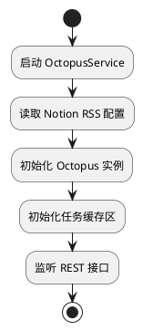
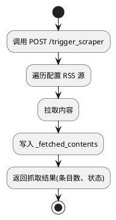
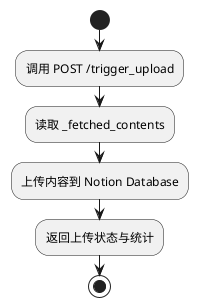

# OctopusService 技术设计文档 (TDD)

## 一、项目背景

Octopus 模块已具备读取 Notion 上配置信息，从多个 RSS 源抓取内容，并将抓取结果上传至 Notion Database 的核心业务逻辑。当前仅能通过本地脚本操作，缺乏服务化能力。为提升系统可集成性、可部署性，需封装为 REST 风格服务组件。

## 二、产品目标

构建 OctopusService 服务模块，基于已有 Octopus 功能对外暴露接口，支持远程触发抓取任务与上传任务，便于部署、调试和系统集成。

## 三、模块功能定义

### F1. 启动与初始化

- 加载 Notion 配置
- 初始化 Octopus 实例（可作为单例）

### F2. 接口触发抓取

- 提供 `/trigger_scraper` 接口
- 执行抓取逻辑，抓取内容写入 `_fetched_contents`

### F3. 接口触发上传

- 提供 `/trigger_upload` 接口
- 执行上传逻辑，读取 `_fetched_contents`，写入 Notion DB

### F4. 状态反馈

- 接口返回统一结构化响应
- 提供抓取条数、上传数等统计

### F5. 健康检查接口

- 提供 `/health` GET 接口，返回 JSON 状态，返回固定 JSON `{"status": "ok"}`，表示服务正常，设计轻量快速，不依赖外部系统

### F6. 日志记录与异常处理

- 使用 `structlog`
- 支持通过环境变量控制格式（plain / JSON）

## 四、模块结构设计

```
src/octopus_scraper/
├── octopus_service.py   # Sanic 服务主入口
└── service_models.py     # 响应数据结构（dataclasses）
```

## 五、接口规范设计

### 5.1 POST /trigger_scraper

- 描述：触发一次抓取任务
- 请求参数（可选）：

```json
{
  "sources": ["source1", "source2"], // 可指定需要抓取的 RSS 源，空则抓取全部
  "limit": 100 // 单次抓取条数限制，默认不限
}
```

- 说明：若无参数或为空，则执行默认全量抓取。
- 响应状态：200 成功 / 500 错误

#### 响应结构（使用 dataclasses）

```python
from dataclasses import dataclass
from typing import Dict, Optional

@dataclass
class TriggerScraperResponse:
    status: str  # "success" | "error"
    message: str
    data: Optional[Dict[str, int]]  # {"source_count": int, "item_count": int}
```

### 5.2 POST /trigger_upload

- 描述：将缓存数据上传至 Notion
- 请求参数（可选）：

```json
{
  "upload_all": true // 是否上传全部缓存内容，false 时只上传新增部分
}
```

- 说明：方便控制上传行为，支持分批次上传。

#### 响应结构：

```python
from dataclasses import dataclass
from typing import Dict, Optional

@dataclass
class TriggerUploadResponse:
    status: str
    message: str
    data: Optional[Dict[str, int]]  # {"uploaded_count": int}
```

### 5.3 GET /health

```python
from dataclasses import dataclass

@dataclass
class HealthCheckResponse:
    status: str  # always "ok" if healthy
```

### 响应输出格式

- 使用 `asdict(model_instance)` 与 Sanic 的 `json()` 结合：

```python
return json(asdict(response_model))
```

## 六、异常与日志处理

### 日志组件

- 使用 [`structlog`](https://www.structlog.org/en/stable/)
- 环境变量控制格式：
  - `LOG_FORMAT=plain`：控制台调试模式
  - `LOG_FORMAT=json`：JSON 格式日志

### 异常捕获策略

- 封装 `@handle_exceptions` 装饰器
- 所有接口都返回结构化错误：

```json
{
  "status": "error",
  "message": "抓取过程中出现异常：<详细错误>"
}
```

- 支持错误码与详细上下文

```json
{
  "status": "error",
  "message": "详细错误描述",
  "error_code": "SCRAPER_TIMEOUT", // 预定义错误码
  "details": {
    "source": "RSS Feed URL",
    "exception": "TimeoutError"
  }
}
```

## 七、状态定义

| 状态字段 | 类型 | 示例值    | 描述         |
| -------- | ---- | --------- | ------------ |
| status   | str  | success   | 接口执行结果 |
| message  | str  | Completed | 任务完成提示 |
| data     | dict | {...}     | 具体统计数据 |

## 八、初始化与依赖

- 启动时初始化 Octopus 实例并缓存到 app.ctx：

```python
@app.before_server_start
async def setup_octopus(app, _):
    app.ctx.octopus = Octopus()
```

- Octopus 提供方法：
  - `fetch_all()`
  - `upload_all()`
  - `_fetched_contents`（属性）

## 九、核心流程图

### 9.1 服务启动流程



### 9.2 抓取任务流程



### 9.3 上传任务流程



## 十、测试点建议

| 用例编号 | 场景                       | 预期结果                              |
| -------- | -------------------------- | ------------------------------------- |
| T01      | 调用 /health 接口          | 返回 200 + {"status": "ok"}           |
| T02      | 正常调用 /trigger_scraper  | 返回 source/item 数量，状态为 success |
| T03      | 正常调用 /trigger_upload   | 返回 uploaded_count，状态为 success   |
| T04      | Octopus 异常（如连接失败） | status 为 error，message 中提示异常   |

## 十一、未来可拓展点（预留）

| 拓展方向     | 建议实现方式                  |
| ------------ | ----------------------------- |
| 接口鉴权     | 添加中间件，基于 Token 校验   |
| 并发任务控制 | 增加任务锁或状态队列机制      |
| 数据缓存     | 使用 Redis 或本地 SQLite 实现 |
| 监控集成     | Prometheus / Grafana 等       |

---

## 十二、配置管理细节补充

### 配置来源：

- Notion 配置通过 Octopus 模块从 Notion API 读取
- 本地支持通过环境变量覆盖配置关键项（如 API token）
- 配置格式示例：

```yaml
notion:
  api_token: "secret_token"
  database_id: "xxxx-xxxx"
rss_sources:
  - name: "Source A"
    url: "https://example.com/rss"
  - name: "Source B"
    url: "https://another.com/rss"
```

### 配置热加载：

- 当前版本不支持热加载，需重启服务生效
- 未来版本可增加文件或数据库监听机制

## 十三、性能及超时控制补充

### 抓取超时：

- 单个 RSS 源拉取超时默认 10 秒（可配置）
- 全任务执行超时可配置，超过返回错误

### 上传超时：

- Notion API 上传请求超时默认 15 秒
- 失败后重试机制，最大重试 3 次，指数退避

### 超时配置示例（环境变量）：

```
SCRAPER_TIMEOUT=10
UPLOAD_TIMEOUT=15
UPLOAD_MAX_RETRIES=3
```

## 十四、接口响应时间及 SLA 补充

### 同步调用说明：

    • /trigger_scraper 和 /trigger_upload 均为同步接口，等待任务完成后返回结果
    • 若任务执行时间较长，接口可能响应延迟

### 超时处理：

    • 接口层面设置请求超时（建议 30 秒）
    • 超时时返回 500 状态及错误信息
    • 未来扩展建议：
    • 引入异步任务队列（如 Celery）实现任务异步执行与状态查询

## 十五、测试细节与自动化补充

### 单元测试：

- 覆盖 Octopus 核心方法调用，模拟抓取和上传流程
- 覆盖异常捕获装饰器，验证错误响应结构

### 集成测试：

- 启动 Sanic 服务，调用接口，断言响应结构与状态码
- 使用 Mock 框架模拟 Notion API 和 RSS 源返回

### 自动化脚本：

- 使用 pytest + httpx 进行接口自动化测试
- CI 集成示例：GitHub Actions 或 GitLab CI

## 16. 日志策略与调试辅助补充

### 日志级别划分：

| 级别  | 描述                 | 典型使用场景                 |
| ----- | -------------------- | ---------------------------- |
| DEBUG | 详细调试信息         | 抓取请求、响应内容、接口调用 |
| INFO  | 关键业务事件         | 抓取开始/结束、上传开始/结束 |
| WARN  | 非致命异常或潜在问题 | 部分源抓取失败、网络波动     |
| ERROR | 关键异常             | 抓取失败、上传失败、服务异常 |

### 日志关键埋点：

- 启动初始化完成
- 每次抓取任务开始结束，成功条数、失败条数
- 每次上传任务开始结束，成功条数、失败条数
- 异常堆栈及上下文信息
- 日志配置示例（伪代码）：

```python
import structlog
import os

log_format = os.getenv("LOG_FORMAT", "plain")

if log_format == "json":
    structlog.configure(
        processors=[structlog.processors.JSONRenderer()]
    )
else:
    structlog.configure(
        processors=[structlog.dev.ConsoleRenderer()]
    )

logger = structlog.get_logger()
```
